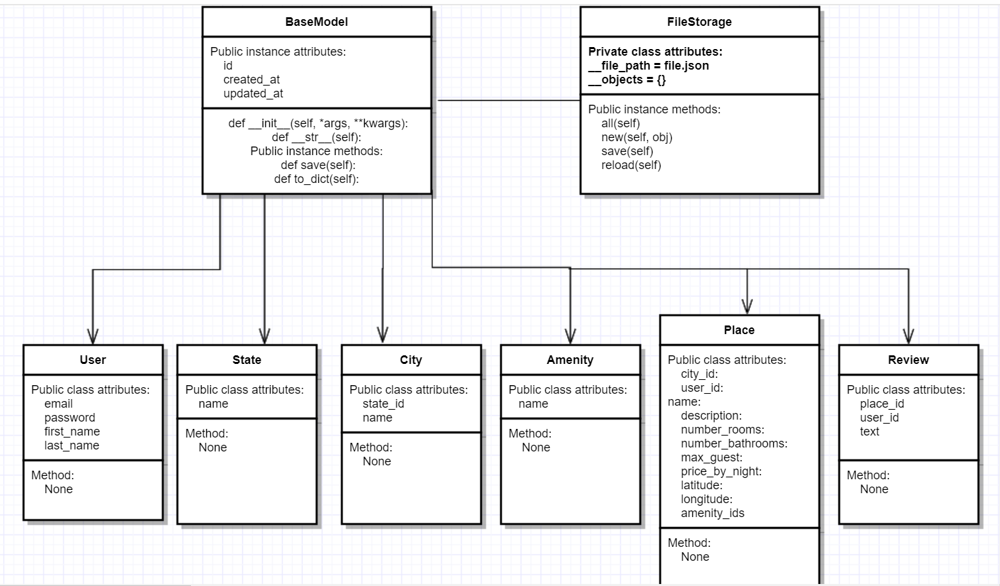

# 0x00. AirBnB clone - The console


## [](https://github.com//marcewp15/AirBnB_clone)Description

### Introduction :page_with_curl:

__First step:__ Write a command interpreter to manage your [AirBnB](https://www.airbnb.com/) objects.
This is the first step towards building your first full web application: the AirBnB clone. This first step is very important because you will use what you build during this project with all other following projects: HTML/CSS templating, database storage, API, front-end integration…

### The console :computer:
* create your data model
* manage (create, update, destroy, etc) objects via a console / command interpreter
* store and persist objects to a file (JSON file)

The first piece is to manipulate a powerful storage system. This storage engine will give us an abstraction between “My object” and “How they are stored and persisted”. This means: from your console code (the command interpreter itself) and from the front-end and RestAPI you will build later, you won’t have to pay attention (take care) of how your objects are stored.

This abstraction will also allow you to change the type of storage easily without updating all of your codebase.

The console will be a tool to validate this storage engine


<p align="center"></p>

### What’s a command interpreter?
It’s similar to the shell of Linux but limited to a specific use-case. In this case, we want to be able to manage the objects of the project:
* Create a new object (ex: a new User or a new Place)
* Retrieve an object from a file, a database etc…
* Do operations on objects (count, compute stats, etc…)
* Update attributes of an object
* Destroy an objec


### Flowchart :art:

<p align="center"></p>


# Requirements :pencil:

## Installation :key:
Use the  [git clone](https://github.com/marcewp15/AirBnB_clone.git) to install this repository
```
git clone https://github.com/marcewp15/AirBnB_clone.git
```

## Usage :wrench:
In the file descriptor you will find the definitions of opcode.
* Your console should work like this in interactive mode:
```
$ ./console.py
(hbnb) help
Documented commands (type help <topic>):
========================================
EOF  help  quit
(hbnb) 
(hbnb) 
(hbnb) quit
$
```
But also in non-interactive mode: (like the Shell project in C)
```
$ echo "help" | ./console.py
(hbnb)
Documented commands (type help <topic>):
========================================
EOF  help  quit
(hbnb) 
$
$ cat test_help
help
$
$ cat test_help | ./console.py
(hbnb)
Documented commands (type help <topic>):
========================================
EOF  help  quit
(hbnb) 
$
```

## Contribution :heavy_check_mark:
This is a project for [Holberton School](https://www.holbertonschool.com/) by Holberton Students. Pull requests are welcome, if you found a bug, you can report us at the email: [1213@holbertonschool.com](mailto:1213@holbertonschool.com) or [970@holbertonschool.com](mailto:970@holbertonschool.com).
Please make sure to update tests as appropriate.
## Authors :performing_arts:
-   [Juan Carlos Lopez Sanchez](https://github.com/Juan-Bogota) - 1213@holbertonschool.com
-   [Lady Marcela Sánchez Moreno](https://github.com/marcewp15) - 970@holbertonschool.com